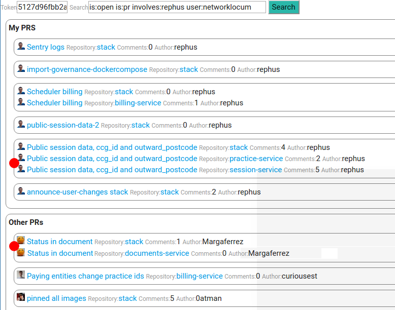

## Github PR tracker

Search issues on github using Github API and group them by author and title.

Also show a flag (red dot) on recently updated PRs

**Update**
Now with browser notifications, every 5 minutes, it makes a request
and triggers a notification if some repos have been updated since the last time you manually refresh the site.

## Instalation

Install nodejs dependencies by doing

    npm install

## Run

    node app.js

Then access the website on the default port [http://localhost:8280/](http://localhost:8280/)

## Setup

Go to [Github > Settings > Personal access tokens](https://github.com/settings/tokens)
and create a personal token for the app to work.

Create a new token with some basic permissions (empty by default should work).

Then add the token to the input text in the main page after running the app.

Alternatively, you can hardcode your token id in the value inside the HTML if
the web is private (don't share your token with anyone).

